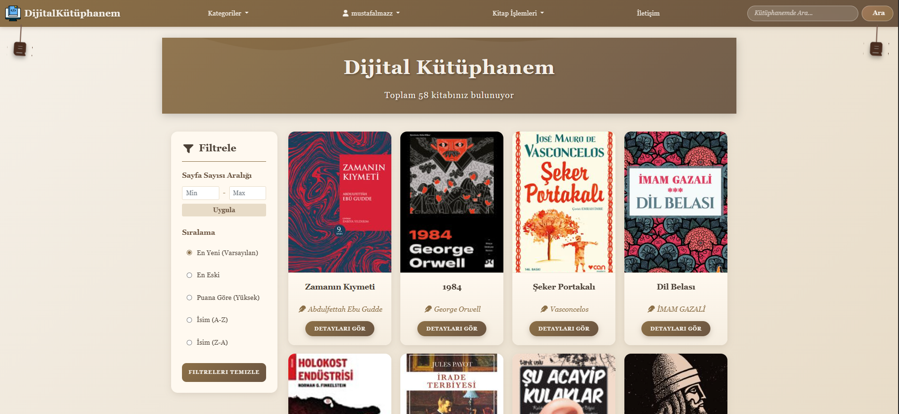
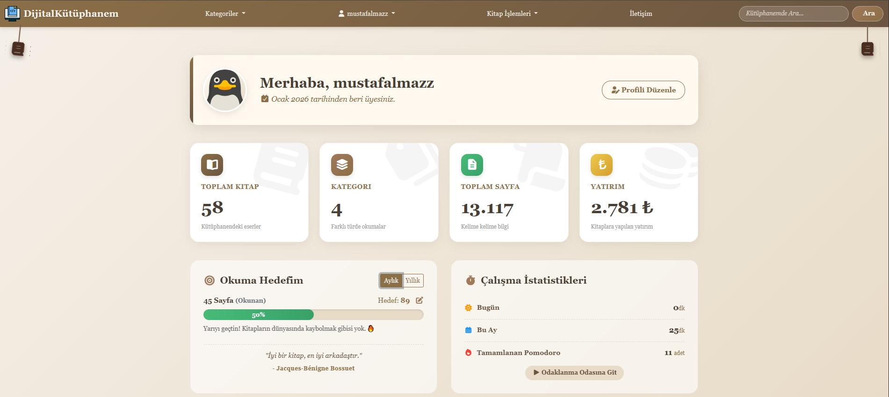
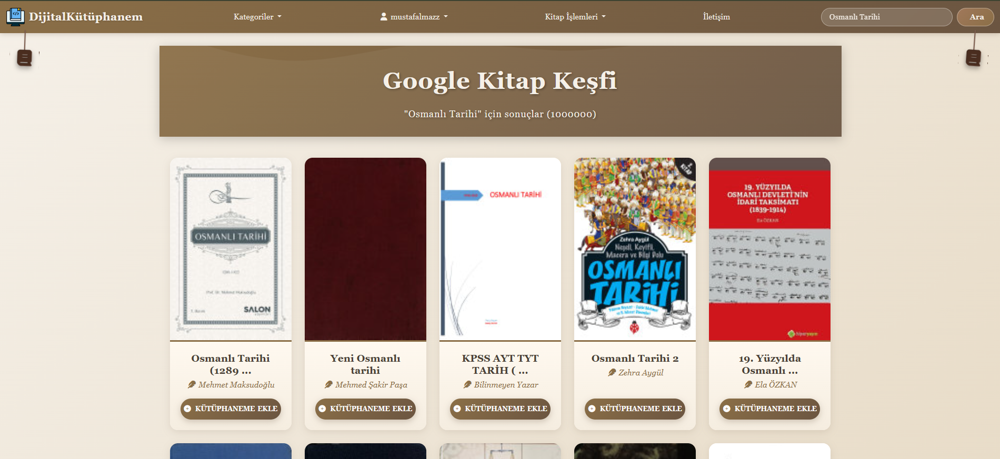
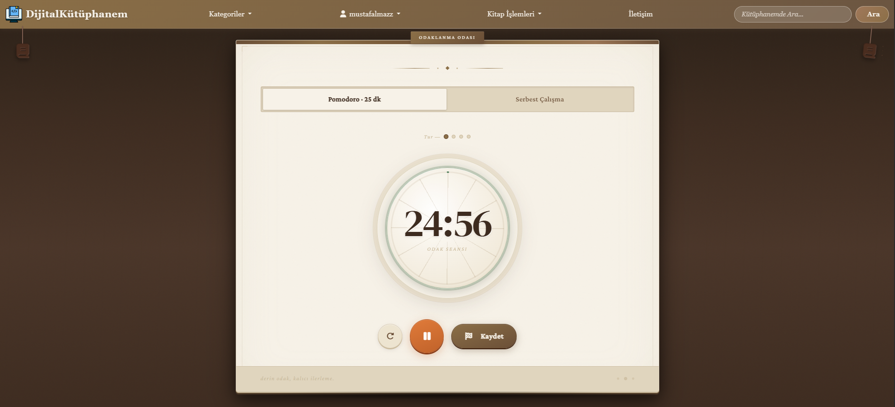
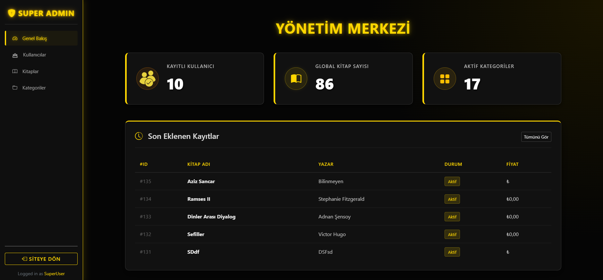

# 📚 Dijital Kütüphanem (Library Management Dashboard)

Bu proje, ASP.NET Core (.NET 8.0) kullanılarak geliştirilmiş, kişisel okuma alışkanlıklarını takip etmeyi ve kitap envanterini yönetmeyi sağlayan kapsamlı bir web uygulamasıdır. Standart veri tabanı işlemlerinin ötesine geçerek, dış API entegrasyonları ve verimlilik araçları (Pomodoro) barındırır.

## 🚀 Öne Çıkan Özellikler ve Entegrasyonlar

* **Google Books API Entegrasyonu:** Kitap ISBN numarası veya adı ile arama yapılarak, kitap detaylarının (Yazar, Sayfa Sayısı, Açıklama, Kapak Resmi) Google sunucularından otomatik olarak çekilmesi.
* **Cloudinary Media Storage:** Kullanıcıların yüklediği kitap kapak resimlerinin yerel sunucu yerine, bulut tabanlı Cloudinary servisinde güvenle saklanması ve optimize edilmesi.
* **Pomodoro Modülü:** Kullanıcıların okuma seanslarını verimli yönetebilmeleri için entegre edilmiş, özelleştirilebilir Pomodoro zamanlayıcısı.
* **Kapsamlı Dashboard:** Okunan kitap sayısı, hedefler ve favori kategorilerin takip edilebildiği kullanıcı dostu arayüz.
* **Dinamik Filtreleme ve Arama:** Kitapların türüne, tarihe ,sayfa sayısına ve yazarına göre hızlıca filtrelenmesi.

## 🛠️ Kullanılan Teknolojiler

* **Backend:** C#, ASP.NET Core MVC (.NET 8.0)
* **Veritabanı:** MS SQL Server, Entity Framework Core
* **Bulut & API:** Google Books API, Cloudinary API
* **Frontend:** HTML5, CSS3, JavaScript, Bootstrap

## 📸 Uygulama Görüntüleri

### Ana Sayfa ve Kullanıcı Paneli

### API Entegrasyonu ve Verimlilik Araçları

### Sistem Yönetimi

